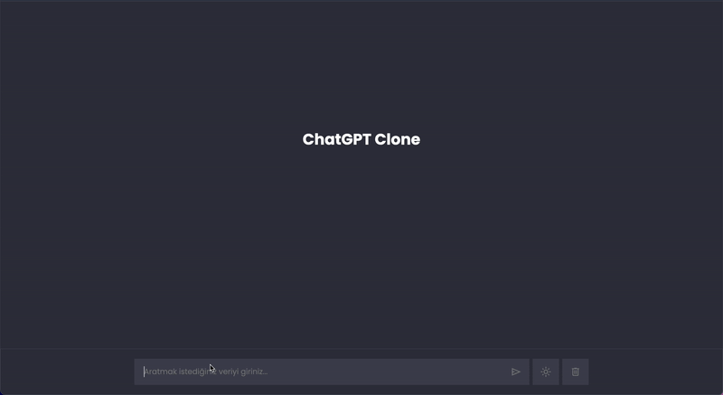

# ChatGPT Clone

The **ChatGPT Clone** is a simple web application that mimics the functionality of a chat interface. Built using HTML, CSS, and JavaScript, this project interacts with the RapidAPI platform to send and receive data, allowing users to have real-time conversations with the clone.

## Features

- **Chat Interface**: Provides a user-friendly chatbox where users can input their messages and receive responses.
- **API Integration**: Sends requests to the RapidAPI platform to fetch AI-generated responses and display them in the chat.
- **Real-Time Conversations**: Mimics the experience of chatting with an AI model by using the RapidAPI data.
- **Responsive Design**: Ensures the chat interface works seamlessly on different screen sizes.

## Technologies Used

- **HTML**: Provides the structure of the web page.
- **CSS**: Styles the chat interface and makes it responsive.
- **JavaScript**: Handles user input, communicates with the API, and dynamically displays responses.
- **RapidAPI**: Used to send and retrieve AI-generated responses via the API.

# ChatGPT-Clone
